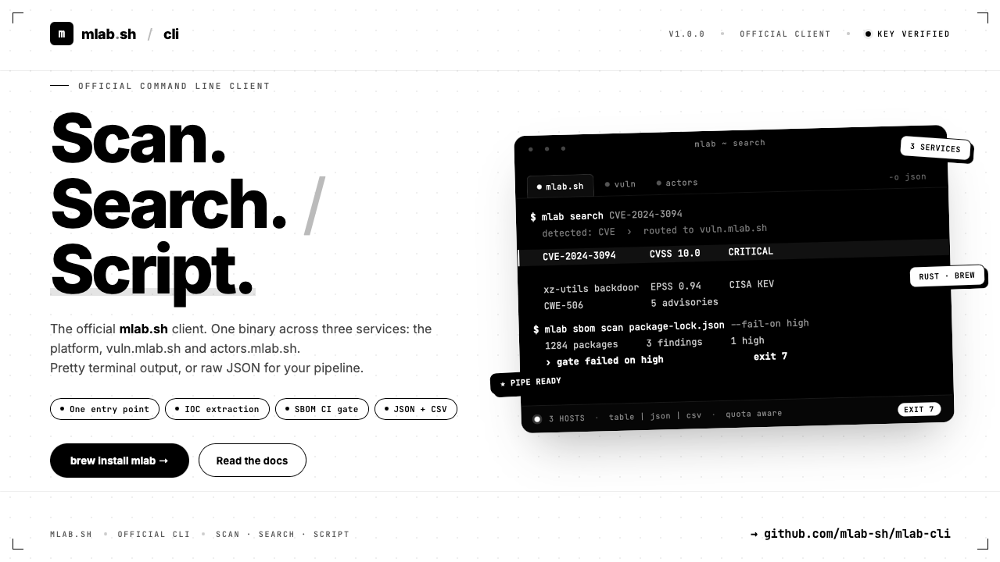

# mlab-cli



`mlab` is the official command-line client for the [mlab.sh](https://mlab.sh)
threat-intelligence platform and its companion services: the CVE and dependency
scanner at [vuln.mlab.sh](https://vuln.mlab.sh) and the threat-actor database at
[actors.mlab.sh](https://actors.mlab.sh).

It lets you scan domains, look up IPs, analyse files, inspect SSL certificates,
check cryptocurrency addresses, and search the CVE database — all from a single
keyboard-driven tool with pretty terminal output or raw JSON for scripting.

```
$ mlab scan domain example.com
$ mlab cve detail CVE-2024-3094
$ mlab limits
```

## Installation

### Homebrew (macOS & Linux)

```bash
brew tap mlab-sh/mlab-cli https://github.com/mlab-sh/mlab-cli
brew install mlab
```

### From a release archive

Download the right tarball for your platform from the
[releases page](https://github.com/mlab-sh/mlab-cli/releases) and drop the
binary into a directory on your `PATH`:

```bash
tar xzf mlab-1.0.1-aarch64-apple-darwin.tar.gz
sudo mv mlab-1.0.1-aarch64-apple-darwin/mlab /usr/local/bin/
```

Pre-built archives are published for:

- `aarch64-apple-darwin` — macOS Apple Silicon
- `x86_64-apple-darwin` — macOS Intel
- `x86_64-unknown-linux-gnu` — Linux x86_64 (glibc 2.35+)
- `aarch64-unknown-linux-gnu` — Linux aarch64 (glibc 2.35+)

Nothing is signed, so every release carries a `SHA256SUMS` covering all of its
assets:

```bash
sha256sum -c --ignore-missing SHA256SUMS
```

### Debian, Ubuntu, Fedora and RHEL

`.deb` and `.rpm` packages for both architectures are on the same page:

```bash
sudo apt install ./mlab_1.0.1_amd64.deb
sudo dnf install ./mlab-1.0.1-1.x86_64.rpm
```

### From source

```bash
git clone https://github.com/mlab-sh/mlab-cli
cd mlab-cli
cargo install --path .
```

Requires Rust 1.74+.

## Authentication

The mlab.sh endpoints require an API key. Generate one from your account at
<https://mlab.sh> and run:

```bash
mlab login
```

`login` verifies the key against the API before storing it, so a typo fails
immediately instead of at the next command. For CI, pass it directly:

```bash
mlab login --key "$MLAB_KEY"
```

The key is written to `~/.mlab/conf.yml` with `0600` permissions. Verify it with
`mlab whoami`, and remove it with `mlab logout`.

A key can also come from the environment or a flag, which take precedence over
the file:

| Source | Example |
|---|---|
| Flag | `mlab --api-key mlab_xxx whoami` |
| Environment | `MLAB_API_KEY=mlab_xxx mlab whoami` |
| Config file | `~/.mlab/conf.yml` |

`MLAB_HOSTNAME`, `MLAB_CVE_HOSTNAME` and `MLAB_ACTORS_HOSTNAME` work the same way
for the three hosts.

`vuln.mlab.sh` uses a **separate** credential: a personal CI token created from
the web account page, supplied as `--vuln-token`, `MLAB_VULN_TOKEN`, or
`vuln_token` in the config file. Most of that host answers unauthenticated — the
token only lifts the per-IP scan rate limit, so CI runners behind shared egress
IPs get their own quota.

The CVE endpoints on `vuln.mlab.sh` are public and require no authentication.

## Commands

### `mlab scan` — launch a scan

| Sub-command | Endpoint | Description |
|---|---|---|
| `scan domain <domain>` | `POST /api/v1/scan/domain` | Launch a full domain scan, poll until completion, render the report |
| `scan ip <ip>` | `GET /api/v1/scan/ip` | Geo, ASN and threat intel for an IPv4/IPv6 address |
| `scan file <path>` | `POST /upload/file` (site root, not under `/api/v1`) | Upload a file (≤ 10 MB) and print the `sha256` to poll |
| `scan crypto <address>` | `GET /api/v1/scan/crypto` | Threat intel for a blockchain address (chain auto-detected; override with `--chain eth/btc/...`) |

Common flags:

- `--json` — emit raw JSON (good for piping into `jq`); accepted by every command
- `--no-follow` (domain only) — fire the scan and exit immediately

`scan domain` follows the scan for at most 15 minutes (`--max-wait`) and stops as
soon as the API reports a failure, rather than polling a dead scan forever. Polls
start at 2 s and back off to 15 s, so a quick scan is caught immediately and a
long one is not asked two hundred times. Safe requests are
retried on transport blips and 5xx, and a `429` with a short `Retry-After` is
honoured; a scan launch is never replayed, so a retry cannot spend your quota
twice.

### `mlab scan` — lookups

| Sub-command | Endpoint | Description |
|---|---|---|
| `scan url <url>` | `GET /api/v1/scan/url` | URL structure, host reputation, lookalike detection. `--resolve` follows redirects (off by default: it fetches the target) |
| `scan hash <h...>` | `GET`/`POST /api/v1/scan/hash` | Reputation for SHA-1/SHA-256/MD5. More than one digest switches to the bulk endpoint |
| `scan email <addr>` | `GET /api/v1/scan/email` | Mailbox type, disposable/role detection, sending-domain posture |
| `scan phone <num>` | `GET /api/v1/scan/phone` | Validity, region, line type, operator |
| `scan mac <mac>` | `GET /api/v1/scan/mac` | Vendor/OUI, randomization, virtualization |
| `scan bash <file>` | `POST /api/v1/scan/file/bash` | Shell-script analysis: suspicious patterns and extracted indicators |
| `scan crypto <a...>` | `GET`/`POST /api/v1/scan/crypto` | More than one address switches to the bulk endpoint |

### `mlab ioc` — pull indicators out of text

```bash
cat incident-report.txt | mlab ioc
mlab ioc report.txt --country fr --risk deep
mlab ioc - --json | jq '.iocs.ipv4[].value'
```

Reads stdin by default, which is the point: pipe an email, a log or a report at
it and get the indicators back grouped by kind. `--risk fast` scores locally,
`--risk deep` adds network checks.

### `mlab network` — capture a page's requests

```bash
mlab network https://example.com
```

Loads the URL in an instrumented browser and lists every request it makes, with
status, resource type, size and failures.

### `mlab status` — check progress

```bash
mlab status domain example.com
mlab status domain example.com --json
```

### `mlab results` — fetch finished results

```bash
mlab results domain example.com
mlab results file <sha256>
mlab results file <sha256> --tool strings   # one tool's raw output
```

`scan file --follow` uploads, waits for the analysis and prints the report in one
go, the way `scan domain` does.

### `mlab ssl` — SSL certificate details

```bash
mlab ssl example.com
mlab ssl example.com --json
```

Expiry is computed against the current date: expired certificates are flagged in
red, ones lapsing within 30 days in yellow. The endpoint returns what a previous
scan collected, so run `mlab scan domain` first on a domain you have never
scanned. The domain report shows the same certificates inline.

### `mlab limits` — quota inspection

```bash
mlab limits                # show all (domain, ip, file, crypto)
mlab limits domain         # one scan type
mlab limits ip --raw       # raw remaining count, easy to script
```

### `mlab actor` — threat actor intelligence (actors.mlab.sh)

```bash
mlab actor list --origin Russia --sector Government
mlab actor get apt28
mlab actor by-cve CVE-2023-23397
mlab actor stix apt28 > apt28.stix.json
mlab actor export --format jsonl > actors.jsonl
```

Public and read-only — no credential. `list` filters on `origin`, `motivation`,
`sector` and `updated_since`, and pages with `--limit`/`--offset` (`--country` is
accepted as an alias for `--origin`, which is the name the API actually reads).
`by-cve` validates the identifier locally, so a typo costs no request.

The dataset comes from ETDA Threat Group Cards and MITRE ATT&CK under
CC BY-NC-SA 4.0, and every rendered view carries that attribution.

### `mlab sbom scan` — dependency scanning for CI

```bash
mlab sbom scan package-lock.json
mlab sbom scan Cargo.lock --fail-on high
mlab sbom scan --url https://raw.githubusercontent.com/o/r/main/go.sum
cat requirements.txt | mlab sbom scan - --format pip
```

The lockfile is sent as-is and the format is detected server-side, so the CLI
never has to learn a manifest format. `--fail-on critical|high|medium|low` exits
`7` when a finding reaches that severity, which is the whole point in CI:

```yaml
- run: mlab sbom scan package-lock.json --fail-on high
```

Severity comes from the advisory's CVSS v3 vector, scored with the same formula
the web UI uses, so the CLI fails on exactly what the site paints red.

**An incomplete scan never passes the gate.** The API distinguishes "this package
has no known vulnerabilities" from "this package could not be scanned", and
reports upstream outages explicitly. When any of that happens, `--fail-on` exits
non-zero with the reason instead of reporting a clean build — a scan that did not
look is not a scan that found nothing.

`--json` keeps the raw payload on stdout *and* still applies the gate.

### `mlab vuln query` — one package coordinate

```bash
mlab vuln query pkg:cargo/time --version 0.1.0
mlab vuln query npm/lodash --version 4.17.11
```

OSV-compatible lookup. An empty result is a real answer ("no known
vulnerabilities"); an upstream outage is an error, never silence.

### `mlab cve` — CVE search (vuln.mlab.sh)

```bash
mlab cve search openssl --severity HIGH
mlab cve search "remote code execution" --date-start 2026-01-01 --exact
mlab cve search apache --vendor redhat --min-cvss 7.5 --kev-only
mlab cve search xss --cwe CWE-79 --page 1 --limit 50
mlab cve detail CVE-2024-3094
mlab cve latest
```

`search` accepts every filter the API supports: `--severity`, `--date-start`,
`--date-end`, `--vendor`, `--cwe`, `--min-cvss`, `--kev-only`, `--exact`, plus
`--page` (0-based) and `--limit` (max 100). Results are paginated server-side and
the CLI tells you when more pages exist. `latest` takes no filters — the endpoint
returns a fixed window.

All `cve` commands accept `--json`. The detail view shows CVSS score & vector,
EPSS probability, CISA KEV status, weaknesses (CWE) and references.

Beyond search, the same host exposes:

```bash
mlab cve dump --date-start 2026-01-01 --min-cvss 7 > cves.json
mlab cve export openssl --severity HIGH --format csv > openssl.csv
mlab cve export "" --kev-only --format rss
mlab cve stats
mlab cve sources
mlab cve advisories --cve CVE-2024-3094
mlab cve vendor microsoft --year 2026
```

`dump` is the heaviest anonymous route and is rate limited per IP: a `429` with a
short `Retry-After` is waited out, a long one is reported as a quota error.
`export` writes to stdout — CSV lives at `/export/csv` and the feed at `/rss`,
both at the site root (the paths the Node SDK documents under `/api/v1` do not
exist).

## Global flags

| Flag | Description |
|---|---|
| `--hostname <url>` | Override the mlab.sh API host (default `https://mlab.sh`) |
| `--cve-hostname <url>` | Override the CVE API host (default `https://vuln.mlab.sh`) |
| `--api-key <key>` | Use this key instead of the stored one |
| `--vuln-token <token>` | vuln.mlab.sh CI token — raises the scan quota |
| `--actors-hostname <url>` | Override the threat-actor API host |
| `--quiet`, `-q` | Suppress spinners and progress output |
| `--output`, `-o` | `table` (default), `json` or `csv` |
| `--dry-run` | Print the request that would be sent, and stop |
| `--timeout <secs>` | HTTP request timeout (default 60) |
| `--max-wait <secs>` | How long to follow a running scan (default 900) |
| `--profile <name>` | Configuration profile to use |

Useful for self-hosted deployments or staging environments.

### `mlab search` — one entry point

```bash
mlab search 8.8.8.8
mlab search abuse@example.com
mlab search CVE-2024-3094
mlab search 0x742d35Cc6634C0532925a3b844Bc454e4438f44e
```

Works out what you pasted — IP, domain, URL, hash, email, phone, MAC, crypto
address or CVE — and routes it to the lookup that owns it, saying what it
detected. Detection is local: an unrecognised value costs no request.

Searching a **domain** reads the existing report rather than launching a scan: a
scan spends quota and takes minutes, so it stays an explicit `mlab scan domain`.

### `mlab open` — jump to the web report

```bash
mlab open example.com
mlab open CVE-2024-3094 --print   # print the URL instead of launching a browser
```

### `mlab config` — read and edit the config file

```bash
mlab config path
mlab config list
mlab config set hostname https://staging.mlab.sh
mlab --profile work config set api_key mlab_xxx
```

Credentials are masked (`mlab…mnop`) unless you pass `--reveal`, so a config dump
pasted into an issue does not leak a key.

**Profiles** let one machine work across several organisations:

```yaml
api_key: personal-key
profiles:
  work:
    api_key: work-key
    hostname: https://mlab.example.internal
```

```bash
mlab --profile work whoami
MLAB_PROFILE=work mlab limits
```

A profile overrides only the fields it sets. Naming one that does not exist is an
error, never a silent fall-through to the default credentials.

### Shell completions and man page

```bash
mlab completions zsh > ~/.zfunc/_mlab
mlab completions bash > /etc/bash_completion.d/mlab
mlab man > /usr/local/share/man/man1/mlab.1
```

## Progress output

Long-running commands show a spinner with an elapsed timer, and a step counter
where the work is countable (`mlab limits` polls four quotas, a followed file
scan reports `3/8 tools`). A followed domain scan tracks the API's own state:
`queued` → `scanning` → `done`.

Three rules govern it:

- **Progress goes to stderr, results go to stdout.** `mlab scan domain x --json |
  jq` is a clean stream; nothing animated ever lands in it.
- **Nothing is drawn unless stderr is a terminal.** Pipes, redirects, CI logs and
  test harnesses get plain output with no escape sequences.
- **Nothing is drawn for fast work.** A spinner only appears once a call has run
  past 300 ms, so quick lookups do not flash.

Turn it off with `--quiet`/`-q`, or `MLAB_NO_PROGRESS=1` — both silence every
status line as well as the spinner. Setting `CI` only turns off the *animation*:
build logs still get the messages, because a warning nobody sees is not a
warning. `--quiet` silences progress only — errors always print.

```bash
mlab -q scan domain example.com --json > report.json
MLAB_NO_PROGRESS=1 mlab limits
```

## Output formats

`--output json` is the uniform equivalent of the per-command `--json`, which
still works. `--output csv` is offered where a command has a genuine tabular
shape — `limits`, `ssl`, `cve search`, `cve latest`, `actor list` and
`sbom scan` — and is refused with a clear message elsewhere, rather than falling
back to a table no spreadsheet can read. `sbom scan --output csv` emits the same
columns, in the same order, as the web scan page's export.

`--dry-run` prints the first request a command would send and stops, which is how
you check what a flag actually does before spending quota on it:

```bash
$ mlab --dry-run scan crypto 1A1zP1eP5QGefi2DMPTfTL5SLmv7DivfNa
GET https://mlab.sh/api/v1/scan/crypto?address=1A1zP1eP5QGefi2DMPTfTL5SLmv7DivfNa
```

## Exit codes

The API reports quota, maintenance and malformed input all as HTTP 400 with the
reason in the body; the CLI classifies that into a code you can branch on.

| Code | Meaning |
|---|---|
| `0` | Success |
| `1` | Generic failure (network, unreadable response) |
| `2` | Authentication — missing, rejected or unrecognized key |
| `3` | Quota exhausted or rate limited |
| `4` | Invalid input (bad domain, unreadable file, unsupported type) |
| `5` | Platform in maintenance |
| `6` | Nothing found (no scan for that domain, unknown hash) |
| `7` | A `--fail-on` gate matched: the scan worked and found something bad enough |

```bash
mlab scan domain example.com || case $? in
  3) echo "out of quota" ;;
  5) echo "maintenance, retry later" ;;
esac
```

## Configuration file

`~/.mlab/conf.yml`, written with `0600` permissions:

```yaml
hostname: https://mlab.sh
cve_hostname: https://vuln.mlab.sh
actors_hostname: https://actors.mlab.sh
api_key: <your key>
vuln_token: <optional vuln.mlab.sh CI token>
```

You can edit it by hand; `mlab login` rewrites it and `mlab logout` clears the
key while keeping the hosts.

## Examples

Scan a domain and dump the JSON report into a file:

```bash
mlab scan domain example.com --json > example.json
```

List the 5 highest-scoring CVEs published last week:

```bash
mlab cve latest --json | jq '.cves | sort_by(-.cvss_score) | .[:5] | .[].id'
```

Quick check that you have crypto quota left:

```bash
mlab limits crypto --raw
```

## Tests

```bash
cargo test
```

Unit tests live next to the code they cover; `tests/cli.rs` drives the real
binary against a throwaway HTTP server on an ephemeral loopback port, with an
isolated `$HOME`, so the suite needs no API key and never reaches the network.

## Releases

The **Release** workflow is a manual trigger from the Actions tab. The version
is whatever `Cargo.toml` says, so a release is a version bump, a commit, and a
click — the tag, the archive names, the packages and the formula cannot
disagree with the binary they contain.

A test gate runs first (`cargo fmt --check`, `cargo clippy -D warnings`,
`cargo test --locked`); nothing is built if any of the three fails. What comes
out:

- Tarballs for the four supported targets, each holding the binary, the README
  and the licence
- A `.deb` and an `.rpm` for both Linux architectures
- A `SHA256SUMS` file covering every asset, since nothing is signed
- An auto-bumped [`Formula/mlab.rb`](Formula/mlab.rb) committed back to `main`,
  so `brew upgrade mlab` picks the new version up on the next refresh

The Linux builds run on `ubuntu-22.04` rather than latest: a glibc binary never
runs against a glibc older than the one it was linked with, and 22.04 lowers
the floor to glibc 2.35, so the packages still install on Debian 12.

To cut a release: bump `version` in `Cargo.toml`, run `cargo build` so
`Cargo.lock` follows, commit, and run the workflow.

The full story is in the wiki: [Releasing](https://github.com/mlab-sh/mlab-cli/wiki/Releasing).

## Documentation

The [wiki](https://github.com/mlab-sh/mlab-cli/wiki) has a page per command and
per concept — [Hosts](https://github.com/mlab-sh/mlab-cli/wiki/Hosts),
[Authentication](https://github.com/mlab-sh/mlab-cli/wiki/Authentication),
[Output](https://github.com/mlab-sh/mlab-cli/wiki/Output),
[Exit codes](https://github.com/mlab-sh/mlab-cli/wiki/Exit-Codes).

Those pages live in [`wiki/`](wiki) in this repository and are mirrored to the
GitHub wiki on every push to `main`. The repository is the source of truth: a
page edited in the wiki web UI is overwritten on the next sync.

## License

Apache-2.0 — see [LICENSE](LICENSE).
